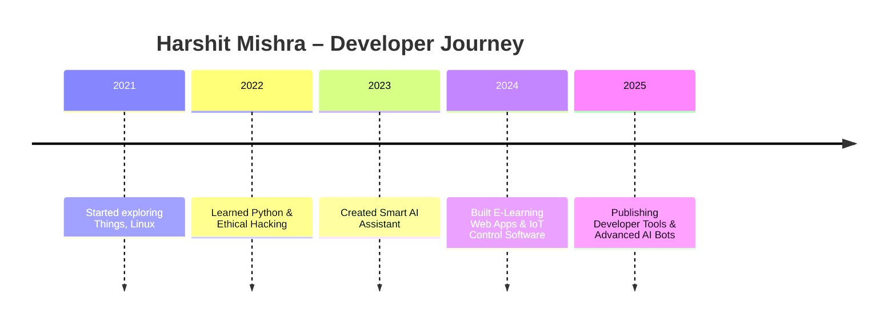

<!-- 🎨 GitHub Stats Theme Showcase for Harshit Mishra | SEO Optimized -->


## ✨ GitHub Pinned Repository Themes By — Harshit Mishra

> Use these GitHub Readme Stats card themes in your profile to style your pinned repos with dark/light/gradient aesthetics and fast cache (1 day).

| Theme | Preview |
|-------|---------|
| Outrun |  |
| Ocean Dark |  |
| City Lights |  |
| GitHub Dark |  |
| GitHub Dark Dimmed |  |
| Discord Old Blurple |  |
| Aura Dark |  |
| Panda |  |
| Noctis Minimus |  |
| Cobalt2 |  |
| Swift |  |
| Aura |  |
| Apprentice |  |
| Moltack |  |
| CodeSTACKr |  |
| Rose Pine |  |
| Catppuccin Latte |  |
| Catppuccin Mocha |  |
| Date Night |  |
| One Dark Pro |  |
| Rose |  |
| Holi |  |
| Neon |  |
| Blue Navy |  |
| Calm Pink |  |
| Ambient Gradient |  |

---

## 🏷️ Shields.io GitHub Badges — Styling & Info Examples


<!-- ⭐ GitHub Star & Fork Badges for mishra9759harshit/github_readme_enhancer.md -->
<p align="center">

  <!-- ⭐ Star Badge -->
  <a href="https://github.com/mishra9759harshit/mishra9759harshit/stargazers">
    
  </a>

  <!-- 🍴 Fork Badge -->
  <a href="https://github.com/mishra9759harshit/mishra9759harshit/fork">
    
  </a>

  <!-- 👤 Follow Badge -->
  <a href="https://github.com/mishra9759harshit?tab=followers">
    
  </a>

</p>


1. **Custom Profile Sections**: Timeline, Tools, Social Cards, Blog Cards
2. **Slideshow of Project Thumbnails**
3. **Mobile-Friendly with Dark/Light Mode Support**

---

## 🌟 Harshit Mishra – Developer | Cybersecurity Enthusiast | AI Assistant Builder

<p align="center">
  
</p>

<p align="center">
  <b>Crafting Secure & Smart Solutions with C, Python, JS, and AI.</b>  
  <br/>
  <i>Let's build something great together!</i>
</p>

---

### 🗓️ Developer Timeline



---

### 🛠️ Tools & Tech Stack

<p align="center">
  
</p>

---

### 🔗 Social & Developer Cards

<p align="center">
  <a href="https://www.linkedin.com/in/mishra9759harshit/">
    
  </a>
  <a href="https://twitter.com/mishra9759">
    
  </a>
  <a href="https://www.instagram.com/mishra9759harshit/">
    
  </a>
  <a href="mailto:mishra9759harshit@gmail.com">
    
  </a>
</p>

---

### 📰 Latest Blog Cards

> Embed dynamic blog updates using GitHub Actions or RSS → Markdown scripts.

```html
<!-- Medium Blog Card Embed Example (manual or GitHub action based) -->
<a href="https://medium.com/@mishra9759harshit" target="_blank">
  
</a>
```

---

### 🖼️ Project Slideshow

> Add this section to display animated project thumbnails.

```html
<!-- Auto slideshow of GitHub project screenshots using CSS animation -->
<div align="center">
  
  
  
</div>

<style>
  .slideshow {
    animation: slide 9s infinite;
    opacity: 0;
    position: absolute;
  }

  .slideshow:nth-child(1) { animation-delay: 0s; }
  .slideshow:nth-child(2) { animation-delay: 3s; }
  .slideshow:nth-child(3) { animation-delay: 6s; }

  @keyframes slide {
    0% { opacity: 0; }
    10% { opacity: 1; }
    30% { opacity: 1; }
    40% { opacity: 0; }
    100% { opacity: 0; }
  }
</style>
```

If you're using markdown-only environments like GitHub README, you can use a [GIF slideshow](https://ezgif.com) or manually rotate images using JavaScript on a hosted webpage.

---

### 🌓 Dark/Light Mode Compatibility

GitHub automatically supports dark/light mode depending on user settings.
You can ensure compatibility by using:

* PNGs/SVGs with transparent backgrounds
* GitHub stats themes: `github_dark`, `rose_pine`, `swift`, etc.
* Skillicons and Shields.io with `style=for-the-badge` (which adjusts better)

For example:

```md

```

---

### ✅ Want This Template?

> Clone or fork this repository and personalize your own `README.md`.

```bash
git clone https://github.com/mishra9759harshit/mishra9759harshit
```

📍 Make sure to replace:

* `USERNAME` with your GitHub handle
* `REPO` with your repo names
* Update image links with your own `GitHub/Photos` or external CDN

---

