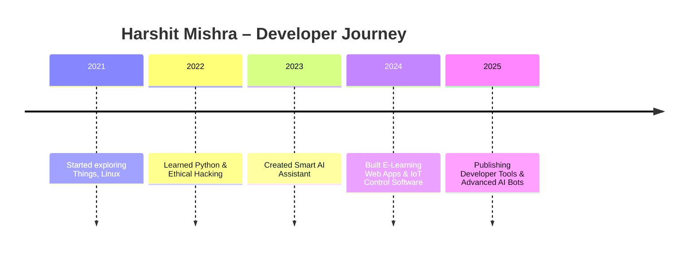

<!-- 🎨 GitHub Stats Theme Showcase for Harshit Mishra | SEO Optimized -->


## ✨ GitHub Pinned Repository Themes By — Harshit Mishra
[](https://github.com/mishra9759harshit)


<p align="center">
  
  
  
</p>
<h3 align="center">"Two Worlds, One Passion: A Journey in Software Engineering & Ethical Hacking"</h3>

<p align="center">
  
</p>

---

<p align="center">
  
</p>

<p align="center"><strong><em>"Code Securely, Innovate Boldly."</em></strong></p>

---

### 📈 Stats & Activity

<p align="center">
  
  
</p>

<p align="center">
  
  
</p>

<p align="center">
  
  &nbsp;&nbsp;
  
  &nbsp;&nbsp;
  
</p>

---

### 🧠 AI Assistant

<p align="center">
  <a href="https://t.me/Intelligent_Real_Time_Assist_bot">
    
  </a><br>
  
</p>

---

### 🛠️ Tools & Technologies

#### 💻 Operating Systems
<p>
  
  
</p>

#### 👨‍💻 Programming
<p>
  
  
  
</p>

#### 🛡️ Cybersecurity Arsenal
<p>
  
  
  
  
  
  
  
  
</p>

#### 🧰 Development Tools
<p>
  
  
  
  
  
  
  
  
  
  
  
  
  
</p>

---

### 🌐 Web Projects

- 🌟 [**Projects Library**](https://mishraharshit.vercel.app/live.html)  
  Explore a collection of open-source web and mobile apps.

- 💘 [**AstroLove**](https://astrolove.vercel.app/)  
  Love compatibility checker powered by astrology and responsive design.

---
### 🎓 Certifications

<p align="center">
  <a href="https://www.credly.com/badges/4298d4e7-7f68-42d8-b71d-d0c4222b4fb1/public_url">
    
  </a>
  &nbsp;&nbsp;&nbsp;
  <a href="https://github.com/mishra9759harshit/Photos/blob/main/cisco.jpg?raw=true">
    
  </a>
  &nbsp;&nbsp;&nbsp;
  <a href="https://github.com/mishra9759harshit/Photos/blob/main/mastercard.jpg?raw=true">
    
  </a>
  &nbsp;&nbsp;&nbsp;
  <a href="https://github.com/mishra9759harshit/Photos/blob/main/linkedin_cert.jpg?raw=true">
    
  </a>
</p>

---

### 📬 Connect With Me

<p>
  <a href="https://mishraharshit.vercel.app"></a>
  <a href="mailto:mishra9759harshit@gmail.com"></a>
  <a href="https://www.linkedin.com/in/harshit-mishra-mr-robot"></a>
  <a href="https://dev.to/mishra9759harshit"></a>
</p>

---

> 🔐 _"Hack the Code. Secure the World."_

<!-- ✅ SEO Meta Tags for Harshit Mishra -->

<!-- Basic Meta -->
<meta name="title" content="Harshit Mishra – Software Developer | Ethical Hacker | Cybersecurity Expert | AI Builder">
<meta name="description" content="Official GitHub profile of Harshit Mishra – A passionate Software Developer and Cybersecurity Professional specializing in C, Python, JavaScript, Ethical Hacking, and Secure Web Applications. Explore projects, AI tools, open-source contributions, and certifications.">

<!-- Keywords -->
<meta name="keywords" content="Harshit Mishra, Software Developer, Ethical Hacker, Cybersecurity, AI Developer, AI Assistant, Secure Coding, C Developer, Python Programmer, JavaScript Developer, Flutter, Firebase, GitHub Projects, Cyber Tools, Penetration Testing, SEToolkit, Metasploit, Secure Web Development, Kali Linux, Cybersecurity Certifications, GitHub README, Full Stack Developer, Frontend, Backend, Open Source Contributor">

<!-- Author & Language -->
<meta name="author" content="Harshit Mishra">
<meta name="language" content="English">

<!-- Robots for Indexing -->
<meta name="robots" content="index, follow">
<meta name="googlebot" content="index, follow">

<!-- Open Graph (OG) for Social Sharing -->
<meta property="og:type" content="profile">
<meta property="og:title" content="Harshit Mishra – Software Engineer | Cybersecurity Specialist">
<meta property="og:description" content="Explore the world of ethical hacking and software development with Harshit Mishra. Projects in AI, cybersecurity, and full-stack development.">
<meta property="og:url" content="https://github.com/mishra9759harshit">
<meta property="og:image" content="https://github.com/mishra9759harshit/Photos/blob/main/IMG_crooun.gif">

<!-- Twitter Card -->
<meta name="twitter:card" content="summary_large_image">
<meta name="twitter:title" content="Harshit Mishra – Full Stack Developer & Cybersecurity Enthusiast">
<meta name="twitter:description" content="GitHub Profile of Harshit Mishra – AI Assistant Creator, Ethical Hacker, and C/Python Developer.">
<meta name="twitter:image" content="https://github.com/mishra9759harshit/Photos/blob/main/IMG_crooun.gif">

<!-- Theme Color (Optional for Mobile Browsers) -->
<meta name="theme-color" content="#0f0f0f">


> Use these GitHub Readme Stats card themes in your profile to style your pinned repos with dark/light/gradient aesthetics and fast cache (1 day).

| Theme | Preview |
|-------|---------|
| Outrun |  |
| Ocean Dark |  |
| City Lights |  |
| GitHub Dark |  |
| GitHub Dark Dimmed |  |
| Discord Old Blurple |  |
| Aura Dark |  |
| Panda |  |
| Noctis Minimus |  |
| Cobalt2 |  |
| Swift |  |
| Aura |  |
| Apprentice |  |
| Moltack |  |
| CodeSTACKr |  |
| Rose Pine |  |
| Catppuccin Latte |  |
| Catppuccin Mocha |  |
| Date Night |  |
| One Dark Pro |  |
| Rose |  |
| Holi |  |
| Neon |  |
| Blue Navy |  |
| Calm Pink |  |
| Ambient Gradient |  |

---

## 🏷️ Shields.io GitHub Badges — Styling & Info Examples


<!-- ⭐ GitHub Star & Fork Badges for mishra9759harshit/github_readme_enhancer.md -->
<p align="center">

  <!-- ⭐ Star Badge -->
  <a href="https://github.com/mishra9759harshit/mishra9759harshit/stargazers">
    
  </a>

  <!-- 🍴 Fork Badge -->
  <a href="https://github.com/mishra9759harshit/mishra9759harshit/fork">
    
  </a>

  <!-- 👤 Follow Badge -->
  <a href="https://github.com/mishra9759harshit?tab=followers">
    
  </a>

</p>


1. **Custom Profile Sections**: Timeline, Tools, Social Cards, Blog Cards
2. **Slideshow of Project Thumbnails**
3. **Mobile-Friendly with Dark/Light Mode Support**

---

## 🌟 Harshit Mishra – Developer | Cybersecurity Enthusiast | AI Assistant Builder

<p align="center">
  
</p>

<p align="center">
  <b>Crafting Secure & Smart Solutions with C, Python, JS, and AI.</b>  
  <br/>
  <i>Let's build something great together!</i>
</p>

---

### 🗓️ Developer Timeline



---

### 🛠️ Tools & Tech Stack

<p align="center">
  
</p>

---

### 🔗 Social & Developer Cards

<p align="center">
  <a href="https://www.linkedin.com/in/mishra9759harshit/">
    
  </a>
  <a href="https://twitter.com/mishra9759">
    
  </a>
  <a href="https://www.instagram.com/mishra9759harshit/">
    
  </a>
  <a href="mailto:mishra9759harshit@gmail.com">
    
  </a>
</p>

---

### 📰 Latest Blog Cards

> Embed dynamic blog updates using GitHub Actions or RSS → Markdown scripts.

```html
<!-- Medium Blog Card Embed Example (manual or GitHub action based) -->
<a href="https://medium.com/@mishra9759harshit" target="_blank">
  
</a>
```

---

### 🖼️ Project Slideshow

> Add this section to display animated project thumbnails.

```html
<!-- Auto slideshow of GitHub project screenshots using CSS animation -->
<div align="center">
  
  
  
</div>

<style>
  .slideshow {
    animation: slide 9s infinite;
    opacity: 0;
    position: absolute;
  }

  .slideshow:nth-child(1) { animation-delay: 0s; }
  .slideshow:nth-child(2) { animation-delay: 3s; }
  .slideshow:nth-child(3) { animation-delay: 6s; }

  @keyframes slide {
    0% { opacity: 0; }
    10% { opacity: 1; }
    30% { opacity: 1; }
    40% { opacity: 0; }
    100% { opacity: 0; }
  }
</style>
```

If you're using markdown-only environments like GitHub README, you can use a [GIF slideshow](https://ezgif.com) or manually rotate images using JavaScript on a hosted webpage.

---

### 🌓 Dark/Light Mode Compatibility

GitHub automatically supports dark/light mode depending on user settings.
You can ensure compatibility by using:

* PNGs/SVGs with transparent backgrounds
* GitHub stats themes: `github_dark`, `rose_pine`, `swift`, etc.
* Skillicons and Shields.io with `style=for-the-badge` (which adjusts better)

For example:

```md

```

---

### ✅ Want This Template?

> Clone or fork this repository and personalize your own `README.md`.

```bash
git clone https://github.com/mishra9759harshit/mishra9759harshit
```

📍 Make sure to replace:

* `USERNAME` with your GitHub handle
* `REPO` with your repo names
* Update image links with your own `GitHub/Photos` or external CDN

---

